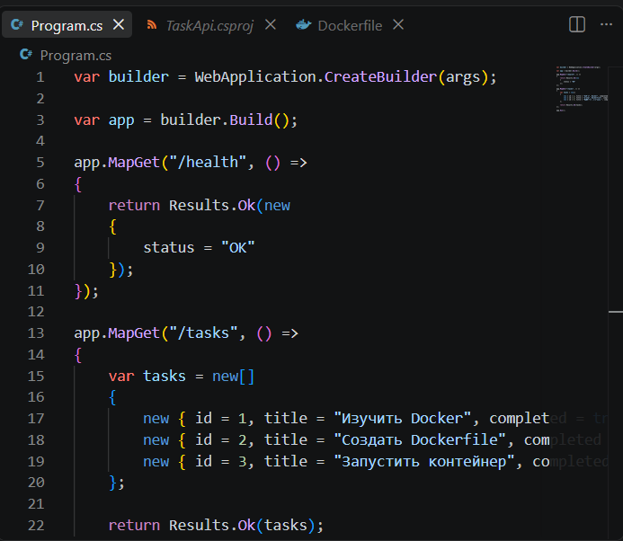
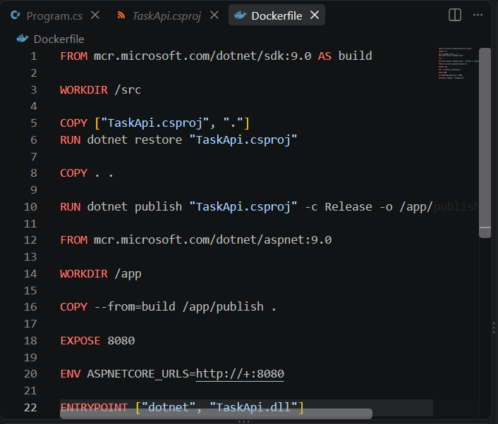
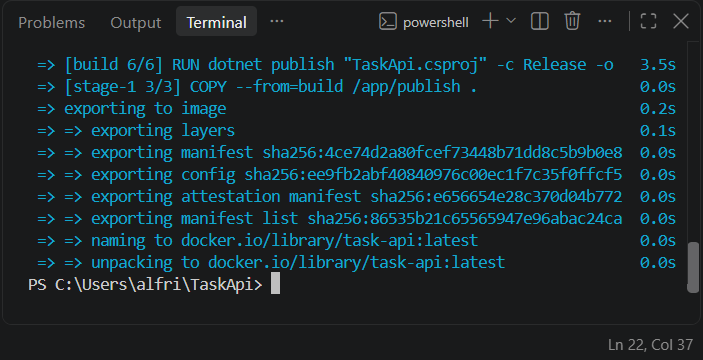
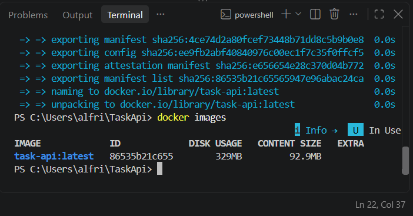
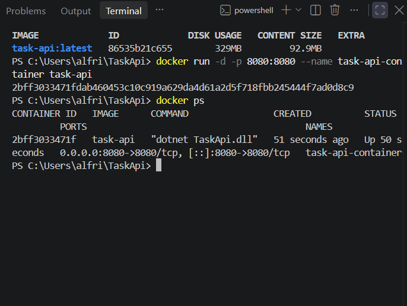
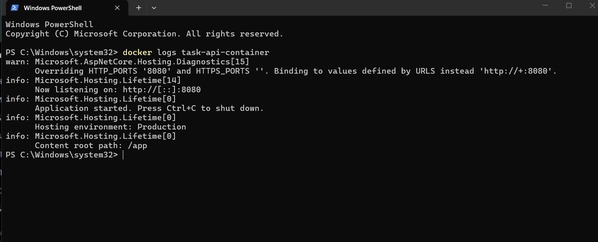
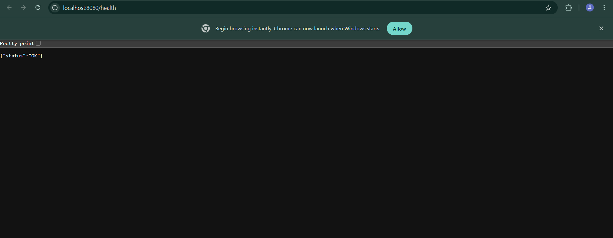
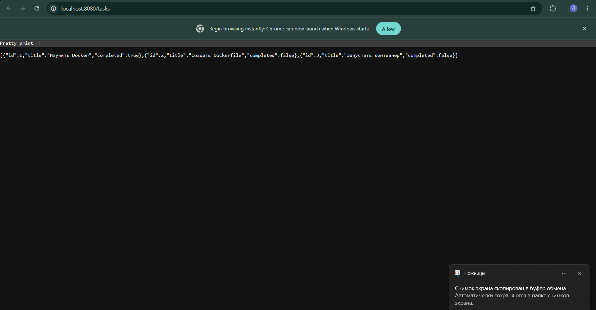

# TaskApi

Учебный проект — простое API на .NET для работы со списком задач, запущенное в Docker-контейнере.

В проекте реализованы два endpoint:
- `/health` — проверка работы API
- `/tasks` — получение списка задач

## 1. API

## 2. Dockerfile

## 3. Сборка Docker-образа

## 4. Docker-образ

## 5. Запуск контейнера и проверка

## 6. Логи контейнера

## 7. Проверка `/health`

## 8. Проверка `/tasks`

