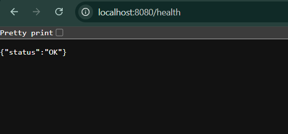
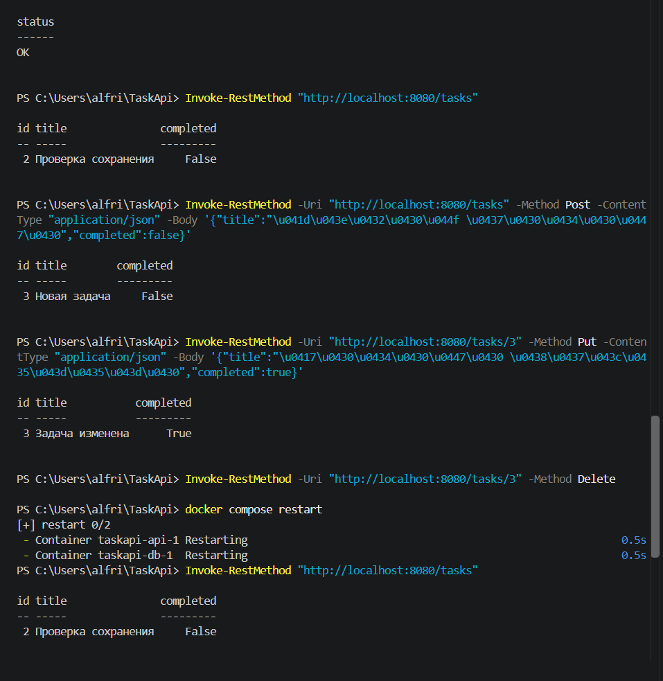
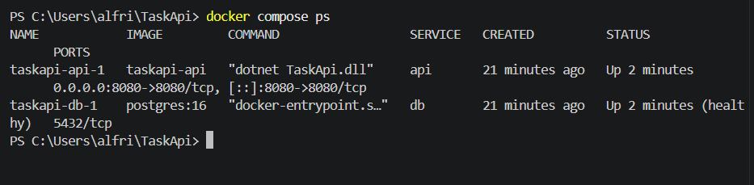

# TaskApi

## Описание проекта

TaskApi — API-сервис для работы с задачами.

Проект реализован на .NET 9 с использованием PostgreSQL 16 и Docker Compose.

Реализованы CRUD-операции с задачами: создание, получение, изменение и удаление.

## Проверка API

### Проверка работоспособности API

### CRUD-проверка

### Проверка Docker Compose

### Проверка сохранения данных после перезапуска

